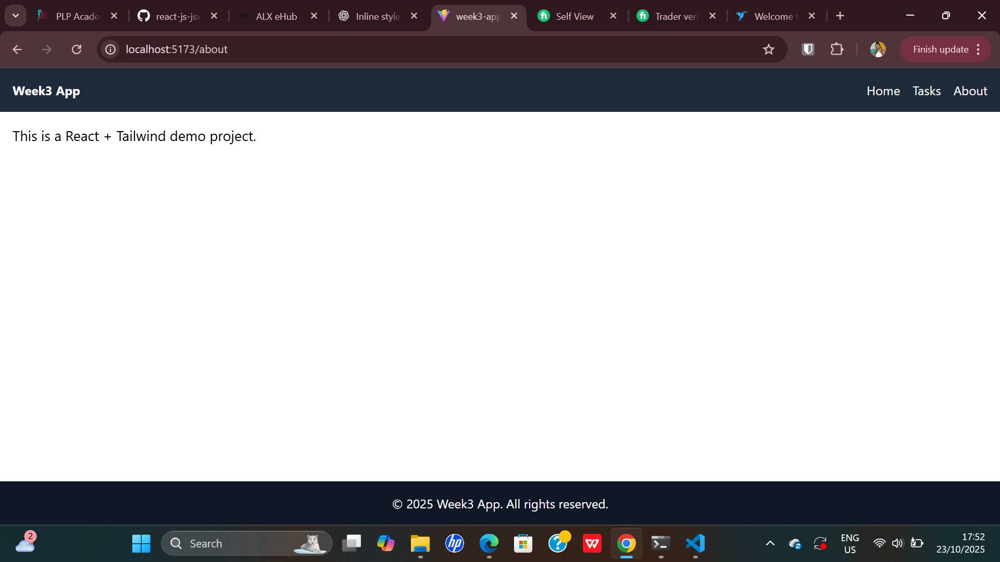
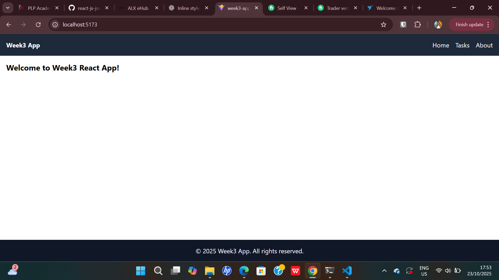
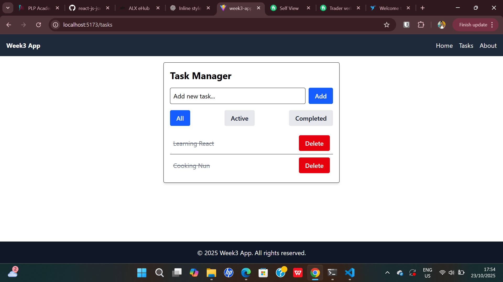

#  Task Manager App

A modern, responsive **React application** built with **Vite**, **Tailwind CSS**, and **React Router**.  
This project demonstrates component-based architecture, state management with hooks, API integration, and clean UI design.

---

##  Tech Stack
-  **Vite** — fast development and build tool  
-  **React** — for building user interfaces  
-  **Tailwind CSS** — utility-first CSS framework  
-  **React Router DOM** — client-side routing  
-  **LocalStorage & Custom Hooks** — for persistence  
-  **Dark/Light Theme** — via Tailwind’s dark mode  

---

##  Project Structure

week3-app/
┣ src/
┃ ┣ components/
┃ ┃ ┣ Button.jsx
┃ ┃ ┣ Card.jsx
┃ ┃ ┣ Navbar.jsx
┃ ┃ ┣ Footer.jsx
┃ ┃ ┗ Layout.jsx
┃ ┣ pages/
┃ ┃ ┣ Home.jsx
┃ ┃ ┣ Tasks.jsx
┃ ┃ ┗ About.jsx
┃ ┣ hooks/
┃ ┃ ┗ useLocalStorage.js
┃ ┣ context/
┃ ┃ ┗ ThemeContext.jsx
┃ ┣ App.jsx
┃ ┣ main.jsx
┃ ┗ index.css
┣ package.json
┣ tailwind.config.js
┗ vite.config.js
---

## 🛠️ Setup Instructions

###  Clone the Repository
```bash
git clone <your-repo-url>
cd week3-app
```

## Install Dependencies
npm install

## Run the Development Server
npm run dev
The app will be available at http://localhost:5173/

## Build for Production
npm run build

## Features
# Component Architecture

Reusable UI components: Button, Card, Navbar, Footer, Layout

Props for customization and flexibility

## State Management

Add, delete, and complete tasks

Filter tasks: All | Active | Completed

Persistent state with custom useLocalStorage hook

## API Integration

Fetch and display data from JSONPlaceholder

Handle loading and error states

Search and filter API results

## Tailwind Styling

Responsive layouts for mobile, tablet, and desktop

Theme toggle (light/dark)

Smooth animations and transitions

## Preview





## Author

Yvonne Samwel 
Software Engineer | Cloud Enthusiast


## License

This project is licensed under the MIT License — feel free to use and modify it.